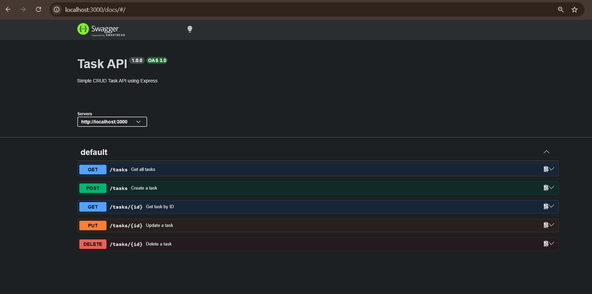

# Task API

A simple RESTful CRUD API built using Node.js and Express.

## Features

- Create a task
- Read all tasks
- Read a task by ID
- Update a task
- Delete a task
- Health endpoint
- Swagger UI documentation

## Installation

Clone the repository

```bash
git clone https://github.com/saijenivarth/task-api.git
```

Install dependencies

```bash
npm install
```

Run the server

```bash
npm start
```

The server starts on

```
http://localhost:3000
```

Swagger documentation

```
http://localhost:3000/docs
```

---

## API Endpoints

| Method | Endpoint | Description |
|---------|----------|-------------|
| GET | / | Root endpoint |
| GET | /health | Health check |
| GET | /tasks | Get all tasks |
| GET | /tasks/:id | Get task by ID |
| POST | /tasks | Create task |
| PUT | /tasks/:id | Update task |
| DELETE | /tasks/:id | Delete task |

---

## Example curl

```bash
curl -i -X POST http://localhost:3000/tasks \
-H "Content-Type: application/json" \
-d "{\"title\":\"Buy milk\"}"
```

Example Output

```http
HTTP/1.1 201 Created
```

```json
{
  "id": 1,
  "title": "Buy milk",
  "done": false
}
```

---

## Swagger UI

Open

```
http://localhost:3000/docs
```

Swagger UI allows testing every endpoint using the **Try it out** button.

---

## Screenshot

Paste the Swagger screenshot here.

Example:


